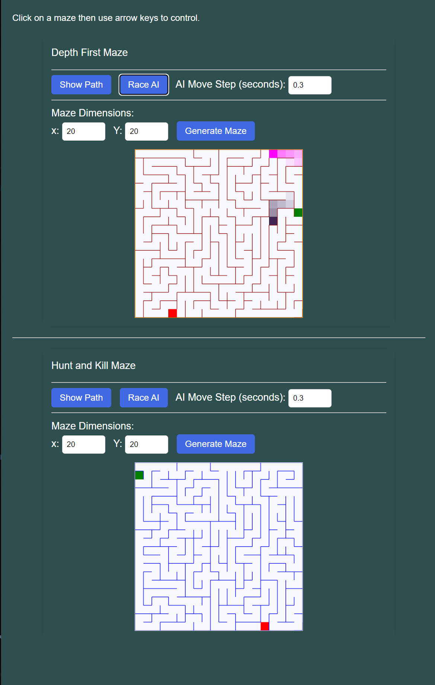

# Maze generator and game template with A* solver

Interactive maze generator with start/end goals, multiple players, an A* solver for pathfinding.

Comes with playable Depth-First and Hunt and Kill generator examples and generally neatly organized classes and explanatory comments.

# Run Example

With latest NodeJS LTS installed. Open this folder in the command line (e.g. via VS Code).

Run: `npm i -g tinybuild` the `npm start` or `tinybuild`




# Usage

Just pull the source and follow along with the example, there's no npm distribution.

```html

Click on a maze then use arrow keys to control.
  <div id="game1">
    <div>Depth First Maze</div>
    <hr/>
    <button id='depthfirstsolve'>Show Path</button>
    <button id='depthfirstrace'>Race AI</button>
    AI Move Step (seconds): <input id='depthfirstintv' value='0.3' type='number'/>
    <div>
        <hr/>
        Maze Dimensions:<br/>
        x: <input id='depthfirstX' type='number' value='20'/>
        Y: <input id='depthfirstY' type='number' value='20'/>
        <button id="gendepthfirst">Generate Maze</button>
    </div>
    <canvas id="canvas1" style="width: 50%;" width="500" height="500"></canvas>
  </div>

  <hr/>
  <div id="game2">
    <div>Hunt and Kill Maze</div>
    <hr/>
    <button id='huntkillsolve'>Show Path</button>
    <button id='huntkillrace'>Race AI</button>
    AI Move Step (seconds): <input id='huntkillintv' value='0.3' type='number'/>
    <div>
        <hr/>
        Maze Dimensions:<br/>
        x: <input id='huntkillX' type='number' value='20'/>
        Y: <input id='huntkillY' type='number' value='20'/>
        <button id="genhuntkill">Generate Maze</button>
    </div>
    <canvas id="canvas2" style="width: 50%;" width="500" height="500"></canvas>
  </div>
<script src="dist/index.js"></script>
```
Assuming the built script template in this repo, else you can add `type="module"` to serve the unbuilt script frp, `src="index.js"`.

```js

import { Maze } from "./src/maze";
import { AStarSolver } from "./src/astar";
import { MazeGame } from "./src/mazegame";
import { generateDepthFirstMaze, generateHuntAndKillMaze } from "./src/generators";

let nCellsPerRow = 20;
let nRows = 20;

const maze1 = new Maze(nCellsPerRow, nRows, generateDepthFirstMaze);
const maze2 = new Maze(nCellsPerRow, nRows, generateHuntAndKillMaze);

const aStarSolver1 = new AStarSolver(maze1);
const aStarSolver2 = new AStarSolver(maze2);

const mazeGame1 = new MazeGame(maze1, 'canvas1', aStarSolver1, 'darkred');
const mazeGame2 = new MazeGame(maze2, 'canvas2', aStarSolver2);

//setup UI
document.addEventListener('keydown', MazeGame.keyDownHandler);

mazeGame1.setAIInputEvents('depthfirstintv', 'depthfirstsolve', 'depthfirstrace');
mazeGame2.setAIInputEvents('huntkillintv', 'huntkillsolve', 'huntkillrace');

mazeGame1.setGeneratorInputEvents('gendepthfirst','depthfirstX','depthfirstY');
mazeGame2.setGeneratorInputEvents('genhuntkill','huntkillX','huntkillY');

```

Add CSS to your liking:

```css
body {
    background-color: darkslategray;
    color:white;
    font-family: Arial, sans-serif;
    line-height: 1.6;
    margin: 0;
    padding: 20px;
  }

  #game1,
  #game2 {
    max-width: 600px;
    margin: 20px auto;
    padding: 15px;
    border-radius: 10px;
    box-shadow: 0 0 10px rgba(0, 0, 0, 0.1);
  }

  #game1 div,
  #game2 div {
    margin-bottom: 15px;
  }

  button {
    padding: 8px 15px;
    font-size: 16px;
    color:white;
    cursor: pointer;
    background-color: royalblue;
    border: 0;
    border-radius: 5px;
    margin-right: 10px;
  }

  button:hover {
    background-color: #4cae4c;
  }

  input[type="number"] {
    padding: 8px;
    width: 60px;
    border: 1px solid #ddd;
    border-radius: 5px;
    margin-right: 10px;
  }

  canvas {
    display: block;
    margin: 0 auto;
    border: 1px solid #ddd;
    background-color: ghostwhite;
  }

  div {
    font-size: 18px;
  }

```
